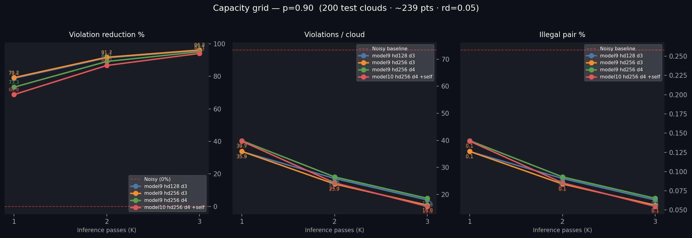

# Capacity Grid — K=1/2/3 Comparison

**Test set:** 200 clouds · ~239 pts · packedness=0.9 · rd=0.05 · noise ∈ [0, 0.02] · seed=1337 (held-out)

**Device:** cuda

**Noisy baseline:** 73.4 viol/cloud · 0.26% illegal pairs

## Violation Reduction %

| Model | K=1 | K=2 | K=3 |
|---|---:|---:|---:|
| model9 hd128 d3 | 78.8% | 91.4% | 95.9% |
| model9 hd256 d3 | 79.2% | 91.7% | 96.2% |
| model9 hd256 d4 | 73.3% | 89.1% | 95.1% |
| model10 hd256 d4 +self | 68.8% | 86.7% | 94.1% |

## Violations / Cloud

| Model | pre | K=1 | K=2 | K=3 |
|---|---:|---:|---:|---:|
| model9 hd128 d3 | 73.4 | 35.8 | 25.9 | 17.9 |
| model9 hd256 d3 | 73.4 | 35.9 | 23.9 | 16.0 |
| model9 hd256 d4 | 73.4 | 39.9 | 26.5 | 18.5 |
| model10 hd256 d4 +self | 73.4 | 39.7 | 24.3 | 15.5 |

## Illegal Pair %

| Model | pre | K=1 | K=2 | K=3 |
|---|---:|---:|---:|---:|
| model9 hd128 d3 | 0.26% | 0.13% | 0.09% | 0.06% |
| model9 hd256 d3 | 0.26% | 0.13% | 0.08% | 0.06% |
| model9 hd256 d4 | 0.26% | 0.14% | 0.09% | 0.07% |
| model10 hd256 d4 +self | 0.26% | 0.14% | 0.09% | 0.05% |

## Mean Displacement / rd

| Model | K=1 | K=2 | K=3 |
|---|---:|---:|---:|
| model9 hd128 d3 | 0.059 | 0.063 | 0.067 |
| model9 hd256 d3 | 0.060 | 0.065 | 0.069 |
| model9 hd256 d4 | 0.066 | 0.072 | 0.076 |
| model10 hd256 d4 +self | 0.074 | 0.085 | 0.091 |

