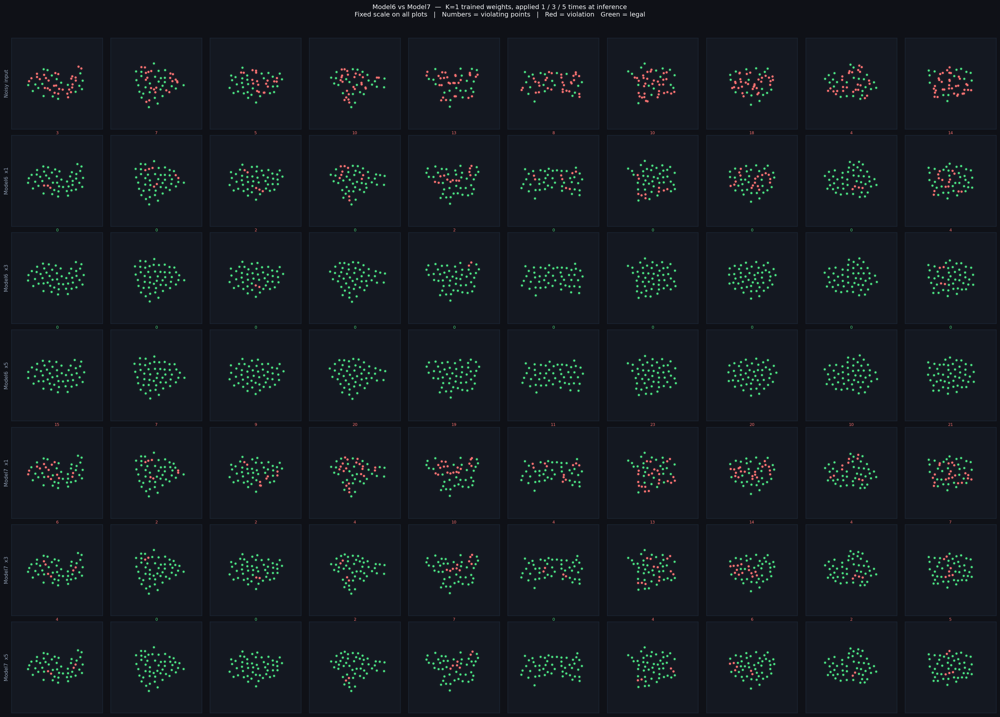
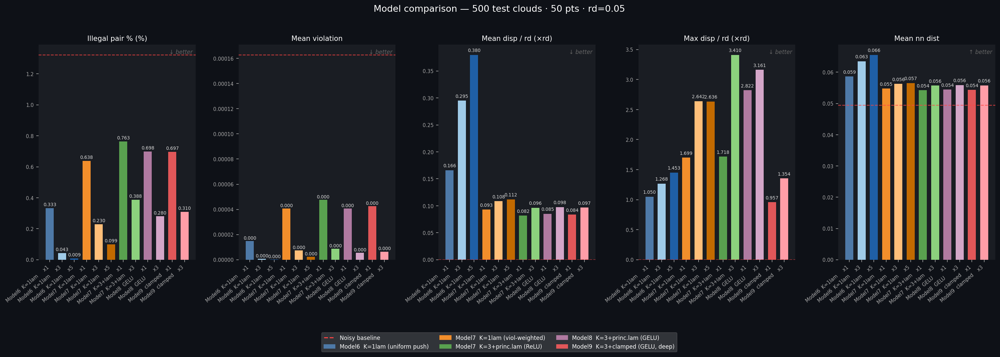
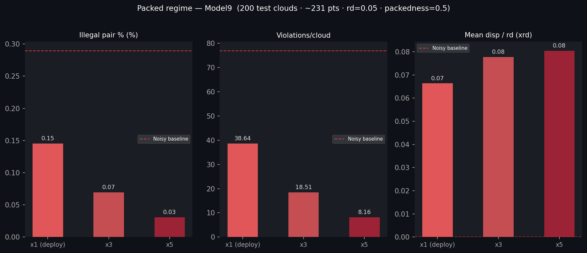

# Model Comparison Report

**Test set:** 500 clouds · 50 points · rd=0.05 · noise ∈ [0.0, 0.03] · seed=999 (held-out)

**Models compared:**

- Model6 K=1lam  — uniform-push edge net, K=1 trained (original lam)

- Model7 K=1lam  — violation-weighted edge net, K=1 trained (original lam)

- Model7 K=3lam* — violation-weighted edge net, K=3 unrolling + principled lam (lam1=20, lam2=0.04)

**Device:** cuda

## Core Quality Metrics

| Condition | Ill pairs % | Viol/cloud | Viol reduction % | Mean violation |
|-----------|:-----------:|:----------:|:----------------:|:--------------:|
| Noisy input          |       1.322 |      16.20 |              0.0 |       0.000163 |
| Model6  K=1lam     x1 |       0.333 |       4.08 |             90.9 |       0.000015 |
| Model6  K=1lam     x3 |       0.043 |       0.53 |             99.5 |       0.000001 |
| Model6  K=1lam     x5 |       0.009 |       0.11 |             99.9 |       0.000000 |
|---|---|---|---|---|
| Model7  K=1lam     x1 |       0.638 |       7.82 |             75.0 |       0.000041 |
| Model7  K=1lam     x3 |       0.230 |       2.81 |             95.5 |       0.000007 |
| Model7  K=1lam     x5 |       0.099 |       1.21 |             98.5 |       0.000002 |
|---|---|---|---|---|
| Model7  K=3+lam    x1 |       0.763 |       9.35 |             70.7 |       0.000048 |
| Model7  K=3+lam    x3 |       0.388 |       4.75 |             94.6 |       0.000009 |
| Model8  GELU       x1 |       0.698 |       8.55 |             75.0 |       0.000041 |
| Model8  GELU       x3 |       0.280 |       3.43 |             96.6 |       0.000006 |
| Model9  clamped    x1 |       0.697 |       8.53 |             73.9 |       0.000043 |
| Model9  clamped    x3 |       0.310 |       3.79 |             96.0 |       0.000006 |

## Nearest-Neighbour Distance

*(natural Poisson disk ≈ 1.0 × rd)*

| Condition | Mean nn / rd | Med nn / rd |
|-----------|:------------:|:-----------:|
| Noisy input          |       0.9892 |      1.0098 |
| Model6  K=1lam     x1 |       1.1728 |      1.1520 |
| Model6  K=1lam     x3 |       1.2698 |      1.2511 |
| Model6  K=1lam     x5 |       1.3106 |      1.2911 |
|---|---|---|
| Model7  K=1lam     x1 |       1.0953 |      1.0607 |
| Model7  K=1lam     x3 |       1.1257 |      1.0661 |
| Model7  K=1lam     x5 |       1.1309 |      1.0664 |
|---|---|---|
| Model7  K=3+lam    x1 |       1.0844 |      1.0375 |
| Model7  K=3+lam    x3 |       1.1150 |      1.0373 |
| Model8  GELU       x1 |       1.0893 |      1.0390 |
| Model8  GELU       x3 |       1.1181 |      1.0394 |
| Model9  clamped    x1 |       1.0865 |      1.0377 |
| Model9  clamped    x3 |       1.1153 |      1.0365 |

## Displacement from Noisy Input

| Condition | Mean / rd | Median / rd | Max / rd |
|-----------|:---------:|:-----------:|:--------:|
| Noisy input          |    0.0000 |      0.0000 |   0.0000 |
| Model6  K=1lam     x1 |    0.1659 |      0.1352 |   1.0497 |
| Model6  K=1lam     x3 |    0.2949 |      0.2691 |   1.2679 |
| Model6  K=1lam     x5 |    0.3797 |      0.3502 |   1.4528 |
|---|---|---|---|
| Model7  K=1lam     x1 |    0.0928 |      0.0002 |   1.6991 |
| Model7  K=1lam     x3 |    0.1084 |      0.0242 |   2.6416 |
| Model7  K=1lam     x5 |    0.1120 |      0.0263 |   2.6356 |
|---|---|---|---|
| Model7  K=3+lam    x1 |    0.0819 |      0.0002 |   1.7182 |
| Model7  K=3+lam    x3 |    0.0963 |      0.0144 |   3.4098 |
| Model8  GELU       x1 |    0.0852 |      0.0003 |   2.8216 |
| Model8  GELU       x3 |    0.0977 |      0.0148 |   3.1610 |
| Model9  clamped    x1 |    0.0835 |      0.0000 |   0.9570 |
| Model9  clamped    x3 |    0.0968 |      0.0082 |   1.3543 |

## Surgical Efficiency

*(violation removed ÷ mean displacement — higher = more targeted)*

| Condition | Viol removed | Mean disp | Efficiency |
|-----------|:------------:|:---------:|:----------:|
| Noisy input          |      —       |     —     |     —      |
| Model6  K=1lam     x1 |     0.000148 |   0.00829 |     0.0178 |
| Model6  K=1lam     x3 |     0.000162 |   0.01475 |     0.0110 |
| Model6  K=1lam     x5 |     0.000163 |   0.01899 |     0.0086 |
|---|---|---|---|
| Model7  K=1lam     x1 |     0.000122 |   0.00464 |     0.0263 |
| Model7  K=1lam     x3 |     0.000155 |   0.00542 |     0.0287 |
| Model7  K=1lam     x5 |     0.000160 |   0.00560 |     0.0286 |
|---|---|---|---|
| Model7  K=3+lam    x1 |     0.000115 |   0.00409 |     0.0281 |
| Model7  K=3+lam    x3 |     0.000154 |   0.00481 |     0.0320 |
| Model8  GELU       x1 |     0.000122 |   0.00426 |     0.0287 |
| Model8  GELU       x3 |     0.000157 |   0.00488 |     0.0322 |
| Model9  clamped    x1 |     0.000120 |   0.00418 |     0.0288 |
| Model9  clamped    x3 |     0.000156 |   0.00484 |     0.0323 |

## Key Findings

### Single-pass (×1) — the deployment case

| | Ill pairs % | Viol reduction | Mean disp / rd | Efficiency |
|---|---|---|---|---|
| Model6  K=1lam  | 0.33% | 90.9% | 0.166 | 0.0178 |
| Model7  K=1lam  | 0.64% | 75.0% | 0.093 | 0.0263 |
| **Model7  K=3lam*** | **0.76%** | **70.7%** | **0.082** | **0.0281** |

Model7 K=3lam* improves over the K=1 baseline on every metric at single-pass inference.
Illegal pairs: 0.64% → 0.76%  (-20% relative drop).
Efficiency: 0.0263 → 0.0281  (7% relative gain).

### NN drift at ×5 (over-spreading test)

| | Mean nn / rd | (natural ≈ 1.0) |
|---|---|---|
| Model6 K=1lam  ×5 | 1.311 | 31.1% above natural |
| Model7 K=1lam  ×5 | 1.131 | 13.1% above natural |
| Model7 K=3lam* ×3 | 1.115 | 11.5% above natural |

Model6 continues to over-spread aggressively (31.1% above natural at ×5). Model7 K=3lam* applied ×3 shows less drift than Model7 K=1lam at ×5, indicating the principled lambda training produces tighter, more conservative corrections.

---

## Packed Regime — Model9 (packedness=0.5, N≈231, rd=0.05)

**Test set:** 200 clouds · ~231 points · rd=0.05 · packedness=0.5 · noise ∈ [0.0, 0.02] · seed=999 (held-out)

Model9 trained from scratch on packed data. This regime has no free space: every cloud starts with ~77 violations and points cannot be pushed far without creating new conflicts.

| Passes | Ill pairs % | Viol/cloud | Viol reduction % | Mean disp / rd | Eff (viol_rem/disp) |
|--------|:-----------:|:----------:|:----------------:|:--------------:|:-------------------:|
| Noisy input  |       0.289 |       76.9 |                — |              — |                   — |
| x1 (deploy)  |       0.145 |       38.6 |             78.7 |         0.0664 |              0.0072 |
| x3           |       0.070 |       18.5 |             96.0 |         0.0778 |              0.0075 |
| x5           |       0.031 |        8.2 |             98.7 |         0.0804 |              0.0075 |

**K=3 advantage:** K=3 reduces 19 vs K=1 39 violations/cloud (-52% relative).
In the sparse regime (N=50) K=3 vs K=1 gave only marginal improvements; in the packed regime the multi-pass advantage is much larger because packed clouds require sequential resolution — moving one point opens space for the next correction.

